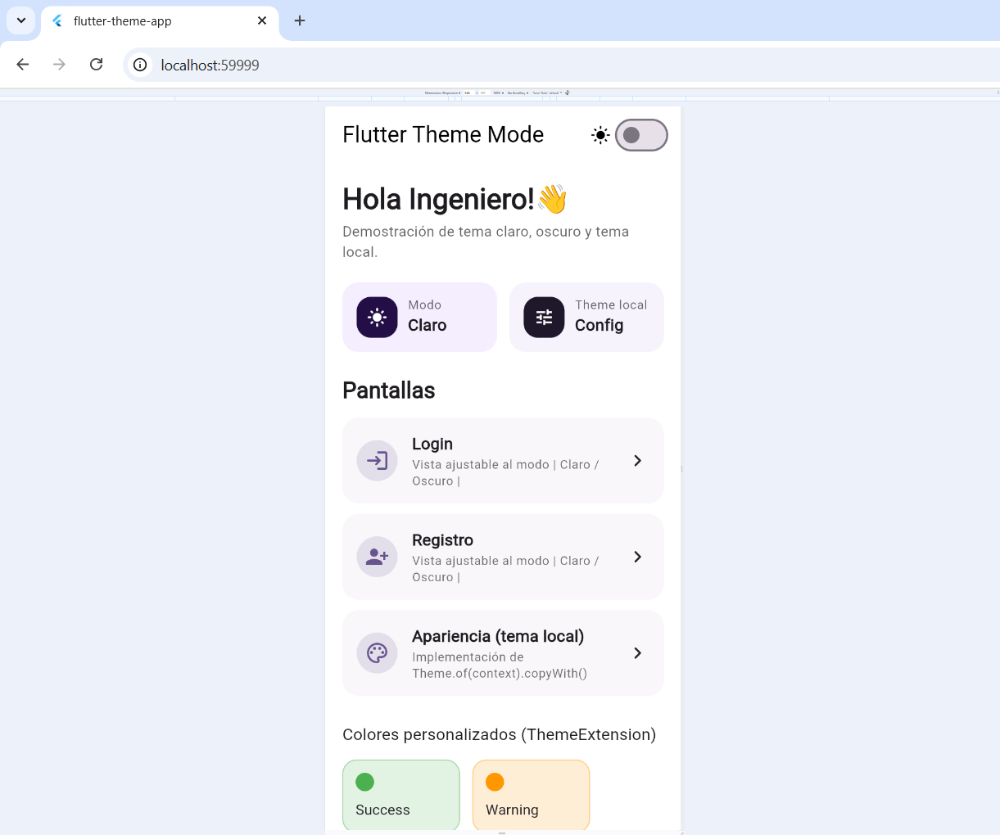
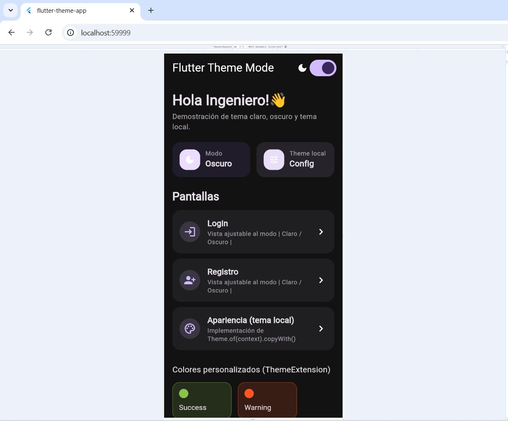
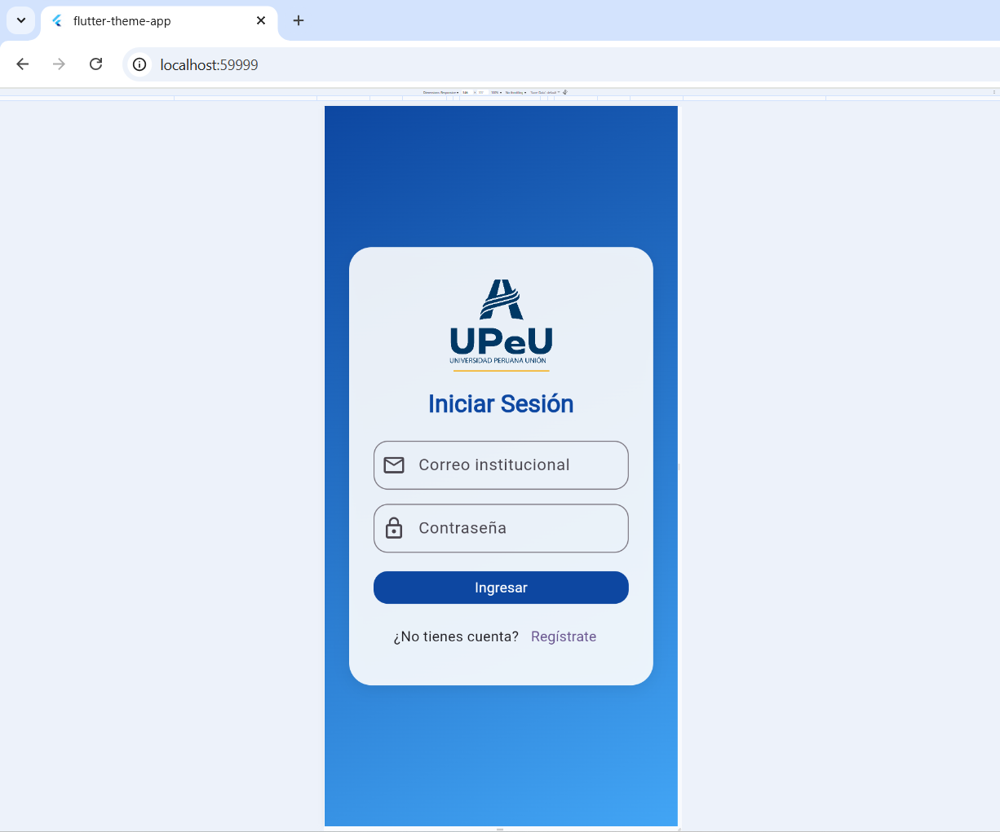
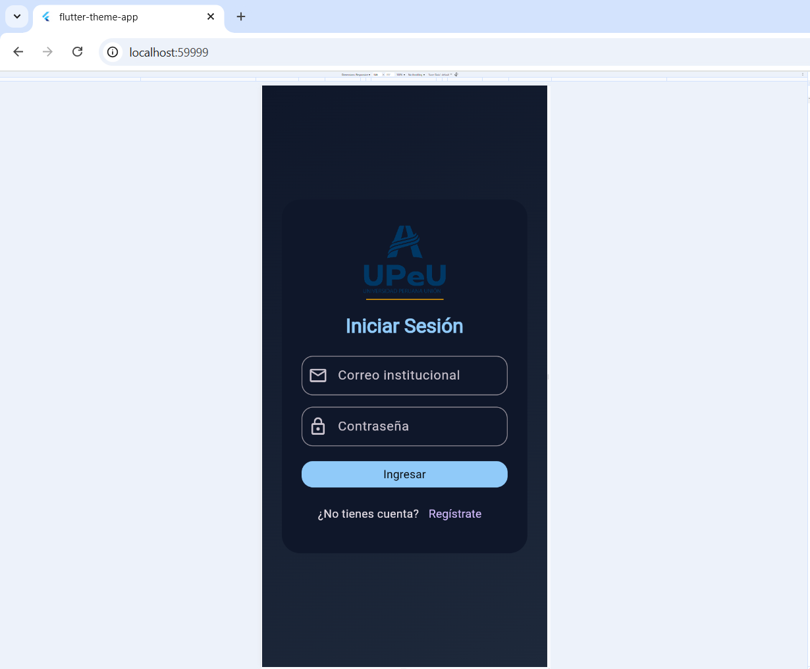
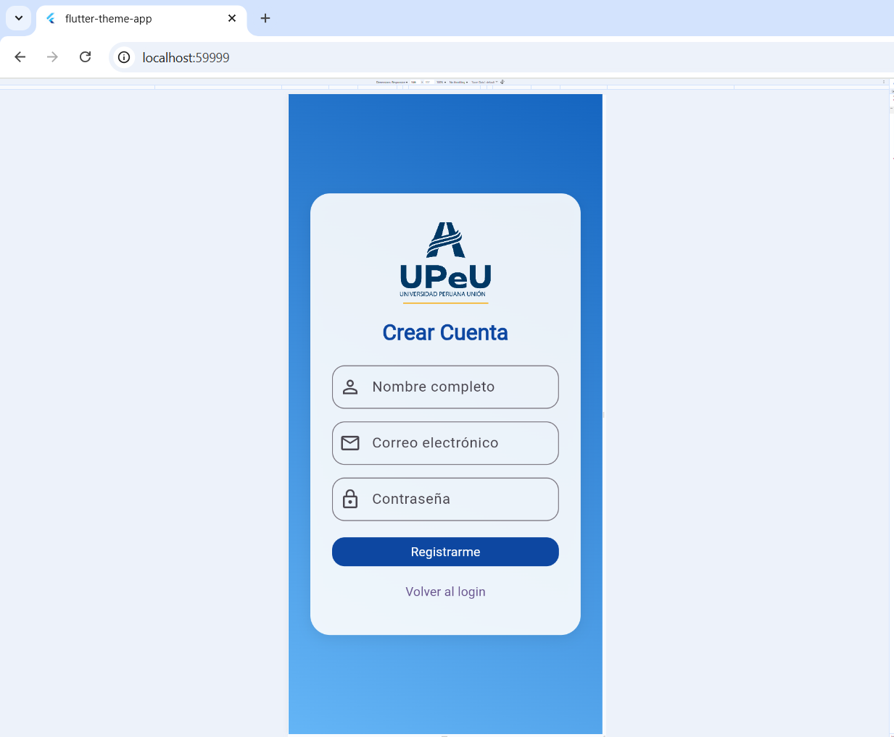
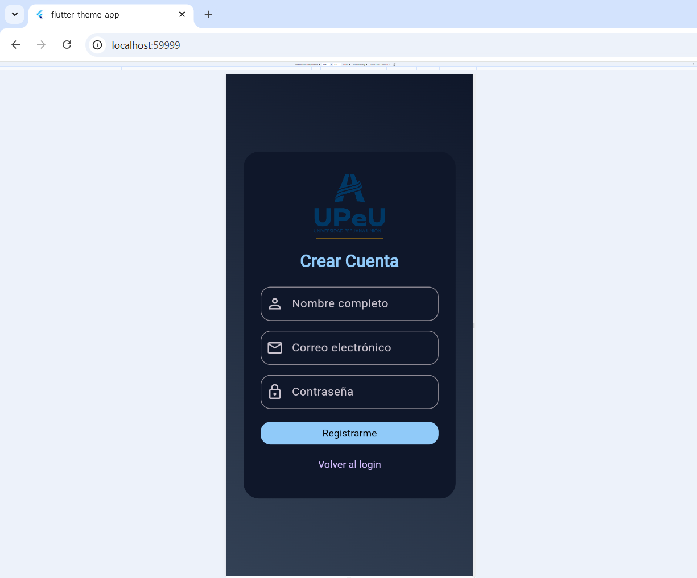
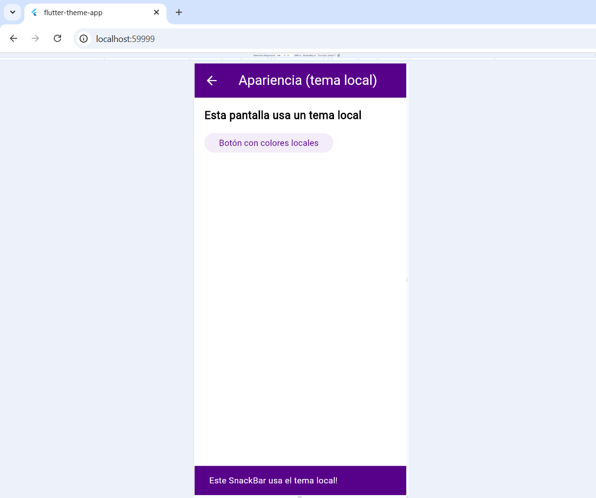
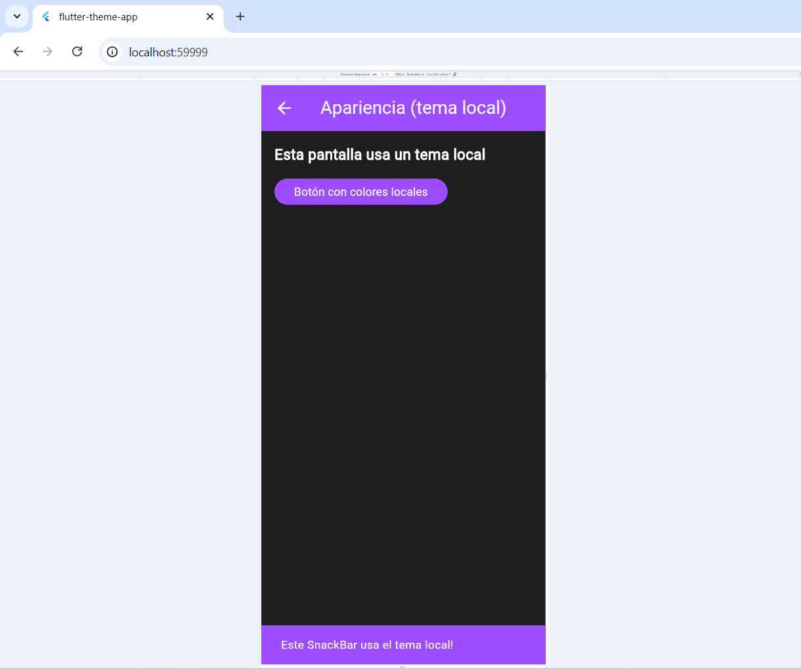

# 🌙 flutter-theme-app-alcca

Aplicación Flutter diseñada para **demostrar el uso avanzado de temas personalizados**, modo **claro/oscuro**, y **ThemeExtension** para crear experiencias visuales coherentes, modernas y adaptables.

Este proyecto muestra cómo aplicar un **tema global**, un **tema local por pantalla**, y cómo **extender ThemeData** para personalizar componentes como pantallas de login y registro.

---

## 🎯 Objetivo

- Aplicar **temas personalizados** en Flutter.  
- Analizar el **impacto visual** del tema en diferentes pantallas.  
- Implementar **modo claro y oscuro** dinámico con `ThemeMode`.  
- Crear un **tema local** con `Theme.of(context).copyWith()`.  
- Extender el sistema de temas usando **ThemeExtension** para colores, gradientes y bordes.  

---

## 🧩 Estructura del proyecto

```text
lib/
 ├─ main.dart
 ├─ theme/
 │   ├─ app_theme.dart                 # Tema global (light y dark)
 │   ├─ auth_theme_extension.dart      # Extensión para pantallas de autenticación
 │   └─ custom_theme_extension.dart    # Extensión para colores personalizados
 ├─ presentation/
 │   ├─ dashboard_screen.dart          # Pantalla principal con switch de tema
 │   ├─ auth_login_screen.dart         # Login adaptado a claro/oscuro
 │   ├─ auth_register_screen.dart      # Registro adaptado a claro/oscuro
 │   └─ appearance_settings_screen.dart # Ejemplo de tema local
 └─ widgets/
     └─ (componentes adicionales si se agregan)
```

## ⚙️ Funcionamiento

### 🌗 1. Tema Global

Definido en `lib/theme/app_theme.dart`, crea dos instancias principales:

- **`AppTheme.lightTheme`** → para el modo claro  
- **`AppTheme.darkTheme`** → para el modo oscuro  

Ambos temas usan `ColorScheme.fromSeed()` para generar paletas visualmente consistentes y modernas, asegurando una armonía entre colores primarios, secundarios y de superficie.

Además, se agregan extensiones personalizadas que amplían el sistema de temas estándar de Flutter, permitiendo definir estilos adicionales como gradientes y colores de estado:

```dart
extensions: [
  AuthThemeExtension.light,
  CustomThemeExtension.light,
]
```

Estas extensiones son clave para personalizar las pantallas de autenticación y otros componentes reutilizables sin romper la coherencia visual del tema global.

### 🔄 2. Cambio Dinámico de Tema

En `main.dart` se gestiona el modo de tema con un `ThemeMode` que permite alternar entre el tema claro y oscuro:

```dart
theme: AppTheme.lightTheme,
darkTheme: AppTheme.darkTheme,
themeMode: _themeMode,
```

El DashboardScreen incluye un Switch que permite alternar entre los modos en tiempo real.
Cada vez que el usuario cambia el estado del switch, toda la aplicación actualiza su apariencia:

```dart
DashboardScreen(
  isDarkMode: _themeMode == ThemeMode.dark,
  onThemeChanged: _toggleTheme,
);
```

### 🎨 3. Tema Local

El archivo `appearance_settings_screen.dart` demuestra cómo aplicar un tema distinto solo a una vista, usando `Theme.of(context).copyWith()`:

```dart
final localTheme = Theme.of(context).copyWith(
  appBarTheme: AppBarTheme(backgroundColor: Colors.deepPurple),
  elevatedButtonTheme: ElevatedButtonThemeData(
    style: ElevatedButton.styleFrom(shape: StadiumBorder()),
  ),
);
return Theme(data: localTheme, child: Scaffold(...));
```
De esta forma se personaliza únicamente esa pantalla, sin alterar el tema global de la aplicación.

### 🔐 4. Pantallas de Autenticación

`auth_login_screen.dart` y `auth_register_screen.dart` utilizan AuthThemeExtension para definir gradientes, colores y bordes adaptados a cada modo de tema:

```dart
final auth = Theme.of(context).extension<AuthThemeExtension>();
final gradient = auth?.loginGradient;
```

Esto permite diferenciar visualmente cada pantalla sin romper la coherencia general del diseño.

### 🧱 ThemeExtension Personalizadas

AuthThemeExtension:
Controla gradientes, colores y bordes de las pantallas de autenticación.

CustomThemeExtension:
Define colores de estado como success, warning, info, reutilizables en toda la app.

Ambas se integran dentro del ThemeData global mediante la propiedad extensions: para acceder a sus valores desde cualquier parte del código.

### 🧪 Ejecución del proyecto

`
flutter pub get
flutter run
`

En el archivo pubspec.yaml asegúrate de incluir las dependencias de materiales y los recursos de imágenes:

`
flutter:
  uses-material-design: true
  assets:
    - assets/images/upeu.png
`

## 📸 Evidencias recomendadas

Incluye estas capturas para documentar los resultados visuales:

| Escenario | Descripción |
|------------|-------------|
| 🟢 Dashboard – Modo claro | Vista general del tema claro |
| ⚫ Dashboard – Modo oscuro | Vista general del tema oscuro |
| 🟣 Login – Modo claro | Fondo degradado celeste, card blanca |
| 🔵 Login – Modo oscuro | Fondo degradado oscuro, card gris |
| 🟡 Register – Modo claro | Fondo blanco, acento azul |
| 🟠 Register – Modo oscuro | Fondo oscuro, texto claro |
| 🎨 Apariencia (tema local claro) | Demostración de `copyWith()` en pantalla local |
| 🎨 Apariencia (tema local oscuro) | Demostración de `copyWith()` en pantalla local |

Guarda las capturas en una carpeta `/docs` dentro del proyecto, por ejemplo:
```
flutter-theme-app-alcca/
├─ lib/
├─ assets/
├─ docs/
│ ├─ dashboard_light.png
│ ├─ dashboard_dark.png
│ ├─ login_light.png
│ ├─ login_dark.png
│ ├─ register_light.png
│ ├─ register_dark.png
│ ├─ local_light.png
│ └─ local_dark.png
```

## 👤 Autor

**Elias Jorge Alcca Condori**  
Proyecto académico: *flutter-theme-app-alcca*  
📅 2025  
🟣 Universidad Peruana Unión  
📘 Curso: Desarrollo de Aplicaciones Móviles – Flutter


# Universidad Peruana Unión


Coppyright:

NekiroVT © coppyright - Todos los derechos reservados 2025

Aprende Flutter en:


- [Lab: Write your first Flutter app](https://docs.flutter.dev/get-started/codelab)
- [Cookbook: Useful Flutter samples](https://docs.flutter.dev/cookbook)

